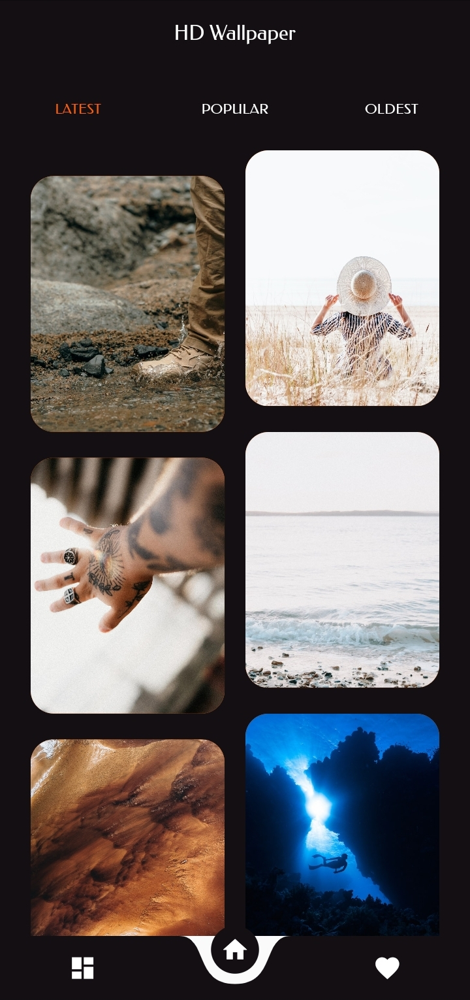
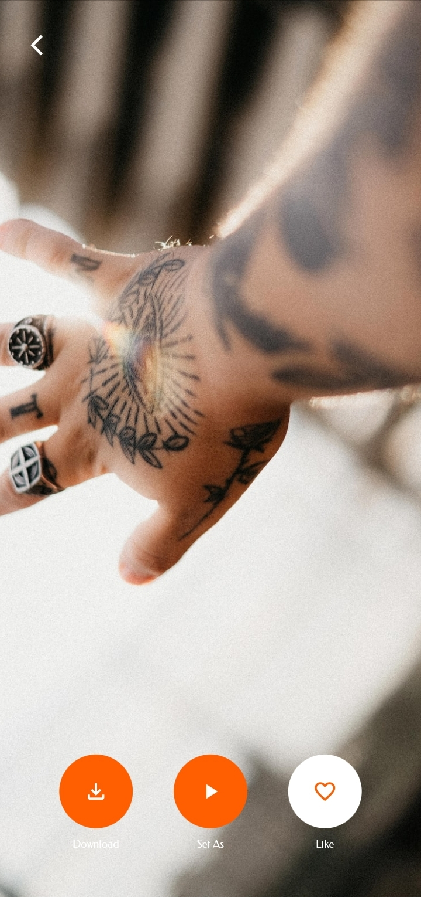

# Flutter HD Wallpaper App

Welcome to the Flutter HD Wallpaper App! This Flutter-powered application provides a collection of high-definition wallpapers for users to personalize their devices.

## Overview
Flutter HD Wallpaper App is your go-to source for stunning wallpapers. Users can browse through various categories, download wallpapers, and set them as their device background.

## Requirements
- Flutter SDK
- Dart SDK
- Other dependencies mentioned in `pubspec.yaml`

## Features
- Extensive collection of high-definition wallpapers
- Categorized wallpapers for easy navigation
- Download wallpapers for offline use
- Set wallpapers directly from the app
- User-friendly interface for a seamless experience

## Walkthrough

https://github.com/Qweku/hd_wallpaper/assets/79706544/9fa7bc78-80fa-4254-9755-337f90af3db7

## Screenshots

| Home Screen | Wallpaper Preview |
|-------------|---------------------|
|  |  | 

## How to Use
- Explore various categories to find the perfect wallpaper.
- Tap on a wallpaper to preview it and choose to download or set it as your device background.
- Save your favorite wallpapers for quick access.
- Enjoy a personalized device with stunning HD wallpapers.

## Major Packages
- `http: ^x.x.x`
- `cached_network_image: ^x.x.x`
- Other packages as listed in `pubspec.yaml`

## Authors
- [Collins Brobbey Jnr](https://github.com/Qweku)
- [Jeffrey Boahen](https://github.com/yellow_Flickr)
